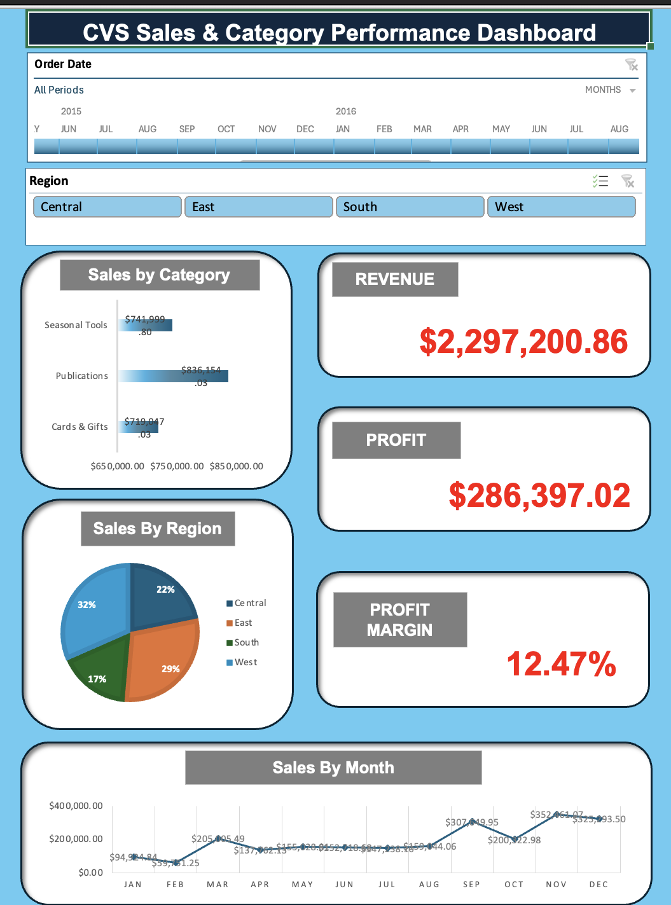

# CVS Retail Category Performance Dashboard (Excel Project)

## Overview

This project analyzes retail sales data across multiple product categories and regions to identify trends, highlight opportunities, and provide merchandising recommendations.  
The dataset includes transactions from **2014–2017**, and the goal was to build a clean, insights-driven **Excel dashboard** using pivot tables, charts, and summary KPIs.

This project demonstrates skills in:
- Data cleaning
- PivotTables & PivotCharts
- Dashboard design
- KPI development
- Retail / category analysis
- Insight-driven storytelling

---

## Key Insights

### 1. Publication is the Top-Performing Category
- Generated **$836K**, the highest among all categories.  
- Indicates strong and sustained customer demand for publication products.  
- Suggests opportunity to expand SKU assortment and optimize in-store placement for this category.

### 2. West Region Drives the Most Sales
- Accounts for **32%** of total revenue — the largest share among all regions.  
- Central region follows at **29%**, then East at **22%**, and South at **17%**.  
- Highlights where customer demand is densest and where merchandising focus should remain strongest.

### 3. Revenue is Strong, but Profit Margin Remains Moderate
- **Total Revenue:** $2.29 M  
- **Total Profit:** $286 K  
- **Profit Margin:** **12.47%**  
- This margin suggests there is room to improve through cost control, pricing strategy, or optimizing the category mix.

### 4. Consistent Seasonal Sales Pattern Over Time
- Monthly sales rise steadily from early-year months into Q3–Q4 each year.  
- Consistent pattern aligns with seasonal trends such as holidays, weather changes, and back-to-school cycles.  
- This makes demand predictable — useful for inventory planning, promotions, and merchandising cycle planning.

---

## Dashboard Preview

---

## Files Included

- **CVS_Category.xlsx** – Full interactive Excel dashboard (pivot tables, slicers, charts)  
- **dashboard_preview.png** – Preview image of the dashboard for quick inspection  
- **README.md** – This documentation  

---

## Recommendations

### 1. Leverage and Expand Seasonal Tools (High-Demand Category)
- Increase SKU assortment and shelf space for Seasonal Tools.  
- Feature the category more prominently during Q3–Q4 via seasonal aisles or endcaps.  
- Increase replenishment frequency during peak demand periods to avoid stockouts.  
- Prioritize this category long-term — data shows sustained demand, not a temporary spike.

### 2. Address Underperformance in the South Region
- South region contributes only **17%** of sales — represents the greatest long-term opportunity for growth.  
- Evaluate whether the current product mix fits local preferences and demographics.  
- Investigate potential supply-chain issues or frequent out-of-stock occurrences.  
- Consider region-specific promotions or merchandising strategies to increase penetration.

### 3. Improve Overall Profit Margin
- Increase prominence of higher-margin items in merchandising and promotional strategy.  
- Reassess vendor contracts for low-margin categories to improve cost structure.  
- Reduce reliance on markdowns by optimizing inventory forecasting and minimizing overstock.  
- Focus on a balanced category mix — mix high-margin with high-velocity items for better profitability.

---

## Tools & Skills Demonstrated

- Microsoft Excel  
- PivotTables & PivotCharts  
- Slicers (Category, Region, Timeline)  
- Data cleaning and normalization (dates, category grouping)  
- KPI calculation and formatting  
- Retail analytics methodology and merchandising logic  

